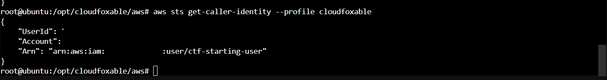

# AWS Cloud Security Engineering

### Cloud Attack-Path Analysis, Controlled Exploitation, Hardening & Retesting

This repository documents a hands-on **AWS cloud security engineering project** built around [CloudFoxable](https://github.com/BishopFox/cloudfoxable), Bishop Fox's intentionally vulnerable AWS training environment.

The objective is to work through the environment as a small cloud security engagement: establish a constrained starting identity, enumerate reachable AWS resources and permissions, identify exploitable misconfigurations and attack paths, demonstrate their impact inside the authorized lab, remediate the underlying weaknesses, and retest the original paths.

> **Authorized lab only.** All testing in this repository is performed against resources deployed in my own AWS account specifically for CloudFoxable. No production or third-party systems are in scope.

## Project Objectives

- Build a repeatable AWS security testing environment from my home lab
- Enumerate AWS resources and IAM relationships from the CloudFoxable starting identity
- Document at least four cloud weaknesses or attack paths
- Validate findings through controlled exploitation in the lab
- Translate technical findings into realistic business impact
- Apply defensive remediation and least-privilege improvements
- Retest each attack path to verify the remediation

## Architecture

```text
Proxmox Home Lab
      │
      └── Ubuntu LXC — Security Workstation
              ├── AWS CLI
              ├── Terraform
              └── CloudFoxable AWS profile
                       │
                       ▼
                  AWS Account
                       │
                       └── CloudFoxable
                           intentionally vulnerable resources
```

**Tooling:** Proxmox · Ubuntu · AWS CLI · Terraform · AWS IAM · AWS STS · CloudFoxable

## Phase 1 — Lab Deployment

The assessment workstation was built as an Ubuntu LXC in my Proxmox home lab. A dedicated AWS deployment identity was used to provision CloudFoxable with Terraform. Identifiers shown in the public evidence have been sanitized.

### Deployment Identity

The deployer identity was configured with the permissions required to build the lab.


### Starting Identity Verification

After deployment, the generated CloudFoxable credentials were loaded into a separate AWS CLI profile. `aws sts get-caller-identity` verified that testing begins as the intended **CTF starting user**, rather than the privileged deployment identity.



This distinction is important to the project: the privileged identity exists to create and destroy the lab, while attack-path testing begins from CloudFoxable's intended starting context.

## Assessment Workflow

Each finding will be documented using the same engineering workflow:

```text
Enumerate
   ↓
Identify weakness
   ↓
Validate attack path
   ↓
Capture evidence
   ↓
Assess technical + business impact
   ↓
Remediate
   ↓
Retest original path
```

A finding is not considered complete when exploitation succeeds. The final step is demonstrating that the remediation prevents or materially restricts the original attack path.

## Status

| Phase | Status |
| --- | --- |
| Home-lab assessment workstation | ✅ Complete |
| AWS CLI / Terraform tooling | ✅ Complete |
| CloudFoxable deployment | ✅ Complete |
| CTF starting identity verification | ✅ Complete |
| Attack-path enumeration | 🚧 In progress |
| Four documented findings | ⏳ Planned |
| Remediation and retesting | ⏳ Planned |
| Business-facing security report | ⏳ Planned |

## Repository Structure

```text
.
├── README.md
├── docs/
│   ├── assessment-plan.md
│   ├── lab-setup-walkthrough.md
│   └── report-outline.md
├── findings/
├── media/
│   └── screenshots/
├── remediation/
│   └── remediation-log-template.md
└── templates/
    └── finding-template.md
```

## Finding Format

Each completed finding will include:

1. **Security weakness**
2. **Discovery and enumeration**
3. **Attack path / validation**
4. **Technical evidence**
5. **Potential business impact**
6. **Root cause**
7. **Remediation**
8. **Retest / proof of fix**

## Security of This Repository

AWS account identifiers and other environment-specific values are redacted from published screenshots. Terraform state, AWS credential files, private keys, variable files, and other secret-bearing artifacts are excluded from version control.

## Attribution

[CloudFoxable](https://github.com/BishopFox/cloudfoxable) is an intentionally vulnerable AWS training platform created and maintained by **Bishop Fox**. This repository contains my own lab deployment documentation, testing evidence, analysis, remediation work, and reporting; it does not redistribute the CloudFoxable project itself.
