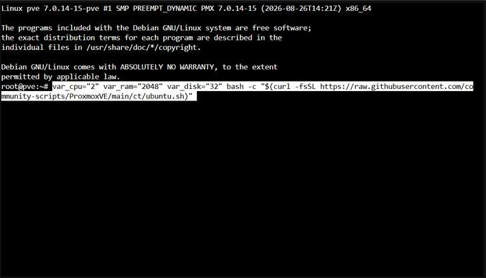
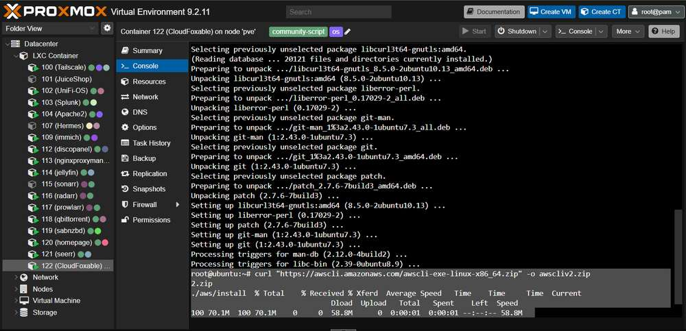
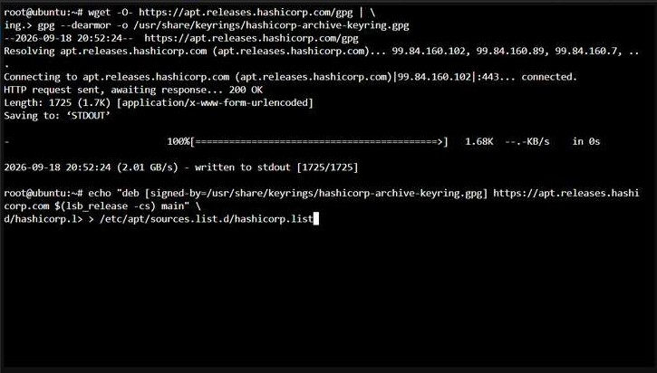
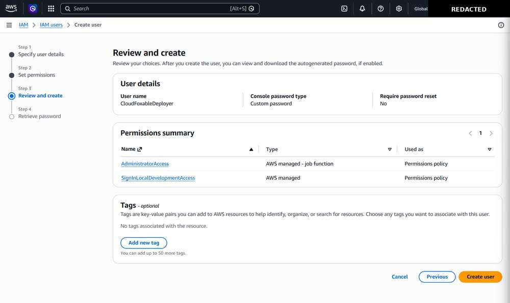
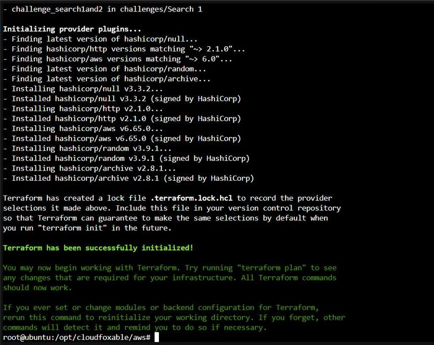
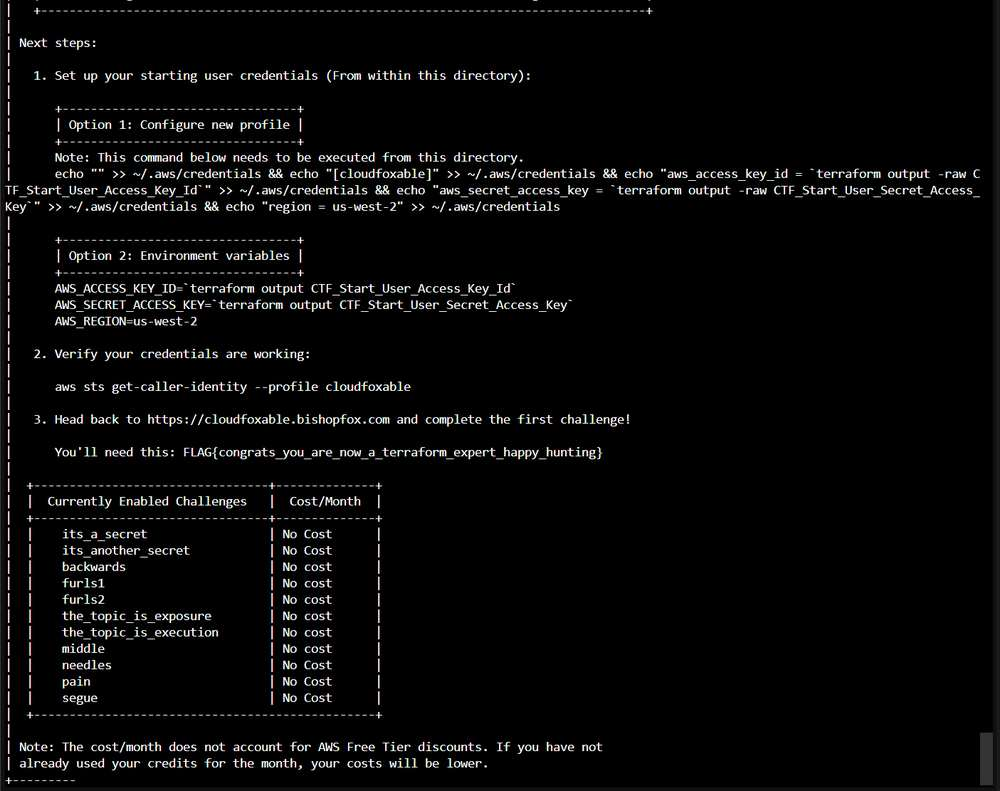
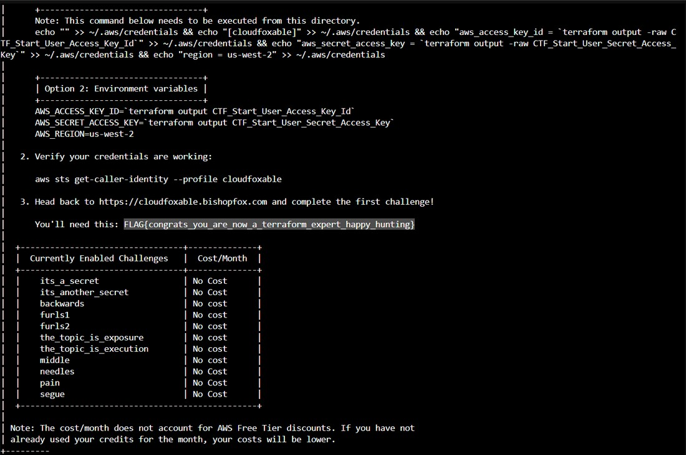

# CloudFoxable Lab Setup

This guide documents how I built the isolated workstation and AWS environment used for the security assessment in this repository.

The deployment phase is intentionally separated from the main project README. The main repository focuses on **enumeration, attack paths, controlled exploitation, remediation, and retesting**, while this page preserves the setup process and supporting evidence.

> The environment shown here is an intentionally vulnerable lab deployed in my own AWS account. Account-specific identifiers have been removed from the public screenshots.

## Architecture

```text
Proxmox
   |
   +-- Ubuntu LXC
         |
         +-- AWS CLI
         +-- Terraform
         +-- CloudFoxable source
                 |
                 v
             AWS Account
                 |
                 +-- Deployment identity
                 +-- CloudFoxable resources
                 +-- CTF starting identity
```

## 1. Build the Ubuntu LXC

I created a dedicated Ubuntu LXC in Proxmox to act as the assessment workstation. Keeping the project in its own container separates the cloud tooling and credentials from my primary systems.

The container was provisioned with 2 vCPUs, 2 GB of RAM, and a 32 GB disk.

```bash
var_cpu="2" var_ram="2048" var_disk="32" bash -c "$(curl -fsSL https://raw.githubusercontent.com/community-scripts/ProxmoxVE/main/ct/ubuntu.sh)"
```



## 2. Install the AWS CLI

The AWS CLI is used for identity verification, enumeration, and testing throughout the project.

```bash
curl "https://awscli.amazonaws.com/awscli-exe-linux-x86_64.zip" -o "awscliv2.zip"
unzip awscliv2.zip
./aws/install
aws --version
```



## 3. Install Terraform

CloudFoxable uses Terraform to create the intentionally vulnerable AWS resources. I added HashiCorp's package repository and installed Terraform inside the LXC.

```bash
wget -O- https://apt.releases.hashicorp.com/gpg \
  | gpg --dearmor -o /usr/share/keyrings/hashicorp-archive-keyring.gpg

echo "deb [signed-by=/usr/share/keyrings/hashicorp-archive-keyring.gpg] \
https://apt.releases.hashicorp.com $(lsb_release -cs) main" \
  > /etc/apt/sources.list.d/hashicorp.list

apt update
apt install terraform
```



## 4. Create the Deployment Identity

I created a dedicated AWS IAM identity named `CloudFoxableDeployer` for provisioning and destroying the lab.

This identity is intentionally separate from the account used to begin attack-path testing. Its purpose is deployment only.



The elevated permissions shown here are specific to the disposable training deployment. They are not presented as a production IAM design.

## 5. Initialize CloudFoxable

The CloudFoxable project was cloned into the assessment workstation and Terraform was initialized from the AWS deployment directory.

```bash
git clone https://github.com/BishopFox/cloudfoxable.git /opt/cloudfoxable
cd /opt/cloudfoxable/aws

terraform init
```



## 6. Deploy the Lab

After reviewing the Terraform plan, I applied the configuration to create the enabled CloudFoxable challenges.

```bash
terraform apply
```

CloudFoxable then provided the next steps for configuring the generated CTF starting identity.



The public repository does not contain Terraform state, generated secret values, AWS credential files, or account-specific identifiers.

## 7. Verify the Starting Identity

The credentials generated by CloudFoxable were loaded into a separate AWS CLI profile named `cloudfoxable`.

Before beginning enumeration, I verified the active identity:

```bash
aws sts get-caller-identity --profile cloudfoxable
```


The result confirms that the assessment begins as:

```text
user/ctf-starting-user
```

## 8. Complete the CloudFoxable Setup Flag

CloudFoxable provides an initial flag after deployment. I submitted this flag to the CloudFoxable scoreboard to confirm that the environment was deployed correctly and that the lab was ready for the actual challenge workflow.

This is **not counted as a security finding** in this project. It is a setup-validation step rather than an exploited AWS weakness.



## Identity Separation

The project uses two distinct AWS contexts:

| Identity | Purpose |
| --- | --- |
| `CloudFoxableDeployer` | Build and destroy the intentionally vulnerable lab |
| `ctf-starting-user` | Starting point for enumeration and controlled attack-path testing |

This separation matters because the assessment is not being performed from the privileged deployment identity. The actual security testing begins from CloudFoxable's intended starting context.

## Next Step

With the environment deployed and the starting identity verified, the project moves into the part that matters most for this repository:

```text
Enumeration -> Attack Path -> Exploitation -> Impact -> Remediation -> Retest
```

Return to the [main project README](../README.md) to follow the assessment.
